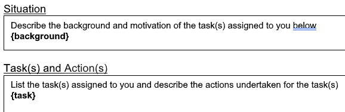

## Programming Solutions for Work Integration (pwsi)

You know what this is for.

```
A tool to help with IWSP reports

Usage:
  pswi [command]

Available Commands:
  help        Help about any command
  new-week    Create a new weekly report through a guided CLI
  parse       Creates a list of reports based on a provided input file
  template    Generate a template for a given start date until today's week

Flags:
  -h, --help   help for pswi

Use "pswi [command] --help" for more information about a command.
```

### Install

Grab the latest version from the [release page](https://github.com/senkawa/pswi/releases/latest) and extract it to a new empty directory. The program takes in inputs and spits out files, so it's best to be in a dedicated new directory.

Alternatively, if you have a working Go toolchain installed, you can use `go install` to install the program to your `$GOPATH/bin` directory.

```shell
go install github.com/senkawa/pswi@latest
```

### Templates

A skeleton of your bi-weekly logs will be used as a "template". This template would have all of its static information filled in (name, company, signature image, etc.), and the rest of the information would be filled in by the command. The template will contain placeholders for the dynamic information. These placeholders are in the form of single curly braces.

> [!NOTE]
> The template should be named `template.docx` and be in the current working directory.



The replaced text will follow the formatting of the placeholder. If the placeholder is bold and underlined, the replaced text will be bold and underlined.

> [!WARNING]
> For now, the tool requires all placeholders to be present in the template. If you're missing a placeholder, the tool will error out.

- `{background}`: Background information for the week. This is usually a summary of what you did for the week.
- `{task}`: The task you were assigned to do for the week.
- `{result}`: The result of the task you were assigned to do for the week.
- `{feedback}`: Feedback for the week. This is usually a summary of what you learned for the week.
- `{week}`: The ISO week number of the report.
- `{date}`: The date of the report.

### Usage

Before you can generate a report, you must first create a template. See the [templates](#templates) section for more information.

There are two ways to generate a report: interactive (`new-week`) and non-interactive (`parse`). The non-interactive mode is useful if you're behind on your reports and need to catch up.

### Interactive

When you're not 20 reports behind, you'll probably want to use the interactive mode. Run the subcommand `pswi new-week` to start the interactive mode.

```
$ pswi new-week --help

Prepare a "template.docx" in the current directory with the following placeholders: {background}, {task}, {result}, {feedback}, {week}, {date}
If you're lazy, you can use the same contents for both report types.

- Leave any of the placeholders empty for N/A. For background/task/result/feedback, multiple lines are supported.
- Leave {date} empty for the current date.
- Leave {week} empty for the current ISO week.
- Outputs will follow the naming convention: {type}-{week}.docx

Usage:
  pswi new-week [flags]
```

Follow the prompts, and you should get a report at the end.

### Non-interactive

```shell
pswi parse <input file>
```

If you need to edit and generate a bunch of reports at once, run the subcommand `pswi parse`. This command takes in 1 argument: the path to the input file. This input file follows the following format:

```markdown
# 2023-04-07 | 7 | 14

Background: example background

Task: - example task 1

- example task 2

Results: more results

Feedback: N/A

# 2023-04-21 | 8 | 16

Background: ...
```

The header signifies the start of a new report. The format it follows is `date | report number | week number`.

#### Generating dates for the input

```shell
pswi template start_date [output_file=output.md]
```

> [!NOTE]
> The `template` subcommand and the *template* file are different two different things.

If you're behind on your reports, figuring out the right dates for the above format can be a pain. To help with this, you can use the `template` subcommand to generate a skeleton that has the headers filled in for you.

For example, if the last report you've submitted was on 2023-04-07, you would run the following command:

```shell
# 2023-04-21 is the next week after 2023-04-07
# Dates are in standard ISO 8601 format (YYYY-MM-DD)
pswi template 2023-04-21
```

It will print out a summary of the dates, and the skeleton will be written to `output.md` by default.

### Usage Summary/Quick Start

- Create a template file with the placeholders.
- Run `pswi template <start date>` to generate a skeleton.
- Fill in the skeleton with the appropriate information.
- Run `pswi parse <input file>` to generate the reports. The reports will be saved to an `output` folder in your current working directory.

### LLMs

Your local LLM should be able to help you with your reports. Use the following as a example prompt to help you get started.

```
# 2023-04-07 | 7 | 14
Background: ...

<fill in 1 example report>

Generate a list of reports <more info here> for these given dates.

# 2023-04-21 | 8 | 16
# 2023-05-05 | 9 | 18
# 2023-05-19 | 10 | 20
```
